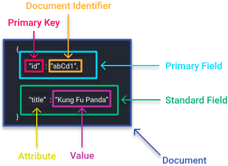

This note is fully based on [the official documentation of Meilisearch](https://www.meilisearch.com/docs).

Table of contents:
* [Introduction](#intro)
* [Setup](#setup)
  * [Local](#local)synonyms
    * [Master key and environments](#master_key)
  * [AWS EC2](#aws)
* [Core concepts](#concepts)
  * [Docs](#docs)
    * [Upload](#upload)
  * [Indexes](#indexes)
    * [Synonyms](#synonyms)
    * [Displayed and searchable fields](#displayed_and_searchable)
    * [Typo tolerance](#typos)
  * [Primary key](#primary_key)
  * [Relevancy](#relevancy)
* [Caveats](#caveats)


<a id="intro"></a>
# Introduction
Meilisearch is an open source RESTful search API designed to meet a vast majority of
needs while requiring very little configuration.

[Key features](https://www.meilisearch.com/docs/learn/what_is_meilisearch/overview#features):
* fast
* typo-tolerant
* supports languages with non-Latin alphabets
* highly customizable, user can define
    * custom ranking
    * filtering
    * stop words
    * synonyms
* secure:
  * protect your instance with API keys
  * tenant tokens help you decide which documents each one of your users can search
* multi-search: perform multiple search queries on multiple indexes with a single HTTP request
* geosearch: filter and sort results based on their geographic location
* index swapping: deploy major database updates with zero search downtime
* search preview: after adding documents to your Meilisearch instance, you can immediately start 
searching through your dataset using [Meilisearch's search preview](https://www.meilisearch.com/docs/learn/getting_started/search_preview)


<a id="setup"></a>
# Setup

<a id="local"></a>
## Local
Meilisearch can be [installed](https://www.meilisearch.com/docs/learn/getting_started/installation) on Linux, macOS and Windows in many ways:
cURL, Homebrew, apt, etc. and there is [an official Docker support](https://www.meilisearch.com/docs/learn/cookbooks/docker).

This is one possible way to run MeiliSearch locally:
* download and install Meilisearch
```
curl -L https://install.meilisearch.com | sh
```
* run Meilisearch
```
./meilisearch
```

By default, Meilisearch runs on port 7700. This can be configured as `./meilisearch --http-addr localhost:1234` or
via environment variable `MEILI_HTTP_ADDR`:


<a id="master_key"></a>
### Master key and environments
Master key is a configuration option used to secure Meilisearch.
* Using `master key` is optional but strongly recommended (and mandatory in production environment).
* It must be any alphanumeric string with 16 or more bytes
* It can be passed as `./meilisearch --master-key="aSampleMasterKey"` or as `MEILI_MASTER_KEY` environment variable.

Meilisearch supports two environment modes:
* `production`
  * setting a master key of at least 16 bytes is mandatory
  * search preview is disabled
* `development`
  * setting a master key is optional
    * this is useful when debugging and prototyping, but dangerous otherwise since API routes are unprotected.
  * search preview is enabled

In both cases, if no master key is provided or if it's under 16 bytes, Meilisearch will suggest a secure autogenerated master key

You can use the following on Google Colab:
```python
import subprocess
subprocess.Popen(['./meilisearch', '--http-addr', 'localhost:1234'])
```


<a id="aws"></a>
## AWS EC2
Meilisearch can easily be [deployed on AWS EC2 instances](https://www.meilisearch.com/docs/learn/cookbooks/aws).

They high level steps are:
1. Launch an EC2 instance using Meilisearch AMI (under the "Community AMIs" section)
   * choose proper instance type (the official guide suggests prioritizing memory allocation
   for better performance)
   * add enough storage (the guide claims that 25 GiB of gp2 storage are good enough for
   datasets with < 1 million documents)
   * set and download key pair for SSH access
2. Update instance's security group to allow
   * SSH traffic (default port 22)
   * HTTP traffic (default port 80)
   * HTTPs traffic (default port 443)
3. Connect to your instance via SSH and run a configuration script `meilisearch-setup`


<a id="concepts"></a>
# Core concepts

<a id="docs"></a>
## Documents
* **Document**: an object which contains data in the form of one or more fields
* **Field**: a set of two data items that are linked together: an attribute and a value
* **Attribute**: the first part of a field. Acts as a name or description for its associated value
* **Value**: the second part of a field, consisting of data of any valid JSON type
* **Primary Field**: a special field that is mandatory in all documents. It contains the **primary key** and **document identifier**



Documents function as containers for organizing data and are the basic building blocks of a Meilisearch database.
To search for a document, you must first add it to an **index**.

An attribute is a name that allows you to store, access, and describe some data.
That data is the attribute's value. In the case of strings, a value can contain at most 65535 positions.
Words exceeding the 65535 position limit will be ignored.

* Every field has a data type dictated by its value. Every value must be a valid JSON data type.
* If a field contains an object, Meilisearch flattens it during indexing using dot notation and brings the object's keys and values to the root level of the document itself.
  * This flattened object is only an intermediary representation—you will get the original structure upon search.
* With ranking rules, you can decide which fields are more relevant than others.


<a id="upload"></a>
### Upload
By default, Meilisearch limits the size of all payloads—and therefore document uploads—to 100MB.
You can change the payload size limit at runtime using the http-payload-size-limit option.

When using the `add new documents endpoint`, ensure:
* The payload format is correct. There are no extraneous commas, mismatched brackets, missing quotes, etc.
* All documents are sent in an array, even if there is only one document
* Milisearch accepts datasets in the following formats:
  * JSON
  * NDJSON (almost the same as jsonlines)
  * CSV


<a id="indexes"></a>
## Indexes
An **Index** is a group of documents with associated settings

An index in Meilisearch is a collection of documents. An index is defined by a `uid` and contains the following information:
* One [primary key](#primary_key)
* Customizable settings
* An arbitrary number of documents

The uid is the unique identifier of an index. It is set when creating the index and must be an integer or string containing only alphanumeric characters a-z A-Z 0-9, hyphens - and underscores _.

Once defined, the uid cannot be changed, and you cannot create another index with the same uid.

All index settings can be reviewed here: https://www.meilisearch.com/docs/learn/configuration/settings.

<a id="displayed_and_searchable"></a>
### Displayed and searchable fields
By default, all fields in a document are both displayed and searchable (this can be modified in index settings):
* **Displayed fields** are contained in each matching document.
* **Searchable fields** are searched for matching query words.
  * This list dictates the [attribute ranking order](#attribute)

All fields are stored in the database. This behavior cannot be changed.
Thus, even if a field is neither displayed nor searchable, it is still stored in the database and can be added to either or both lists at any time.

<a id="synonyms"></a>
### Synonyms
* If multiple words have an equivalent meaning in your dataset, you can create a list of synonyms. This will make your search results more relevant.
* All synonyms are lowercased and de-unicoded during the indexing process.
* When a multi-word phrase is considered the synonym of another word or phrase, the exact search query will always take precedence over its synonym(s).
* Multi-word synonyms are limited to a maximum of three words. For example, although you could make "League of Legends" and "LOL" into synonyms, you could not do the same for "The Lord of the Rings" and "LOTR".

<a id="typos"></a>
### Typo tolerance
* The typo rules are by word and not for the whole query string.
* Meilisearch considers a typo on a query's first character as two typos.
* By default, Melisearch allows the following number of typos given word length:
    * 1-4 characters: no typos allowed,
    * 5-8 characters: 1 typo allowed
    * 9+ characters: 2 typos allowed
* When considering possible candidates for typo tolerance, Meilisearch will concatenate multiple search terms
 separated by a space separator. This is treated as one typo. For example,
 a search for `any way` would match documents containing `anyway`.


<a id="primary_key"></a>
## Primary key
Each index must have a **primary field** - a special field that must be present in all documents in that index.
* It uniquely identifies each document in an index, ensuring that it is impossible to have two exactly identical documents present in the same index.
* Its attribute is the **primary key** and its value is the **document id**.
  * The document id must be an integer or a string.
  * If the id is a string, it can only contain alphanumeric characters (a-z, A-Z, 0-9), hyphens (-), and underscores (_).
* Aside from the primary key, documents in the same index are not required to share attributes.
  * Two documents in an index can have the same values for all attributes except the primary key.
  * If two documents in the same index have the same id, then they are treated as the same document and the preceding document will be overwritten.
  * Document addition requests in Meilisearch are atomic. This means that if the primary field value of even a single document in a batch is incorrectly formatted, an error will occur, and Meilisearch will not index documents in that batch.
* You can set the primary key explicitly or let Meilisearch infer it from your dataset.
  Whatever your choice, an index can have only one primary key at a time, and the primary key cannot be changed while documents are present in the index.
  * Setting primary key on index creation: `client.create_index('INDEX_NAME', {'primaryKey': 'PRIMARY_KEY'})`
  * Setting primary key on document addition to the empty index: `client.index('INDEX_NAME').add_documents(LIST_OF_DOCS, 'PRIMARY_KEY')`
  * Changing primary key requires deletion of all documents from the index, changing the key and adding them again:
  `client.index('INDEX_NAME').update(primary_key='PRIMARY_KEY')`
* Suppose you add documents to an index without previously setting its primary key.
  * In this case, Meilisearch will automatically look for an attribute ending with the string `id` in a case-insensitive manner (for example, uid, BookId, ID) in your first document and set it as the index's primary key.
  * If Meilisearch finds multiple attributes ending with `id` or cannot find a suitable attribute, it will throw an error.
    * In both cases, the document addition process will be interrupted and no documents will be added to your index.


<a id="relevancy"></a>
## Relevancy
Relevancy refers to the accuracy and effectiveness of search results. If search results are almost always appropriate, then they can be considered relevant, and vice versa.

Ranking rules:
* Each index possesses a list of **ranking rules** stored as an array in the settings object.
* This array is fully customizable, meaning you can delete existing rules, add new ones, and reorder them as needed.
* Meilisearch uses a bucket sort algorithm to rank documents whenever a search query is made:
  * the first ranking rule applies to all documents;
  * each subsequent rule is only applied to documents considered equal under the previous rule as a tiebreaker;
  * thus, the order in which ranking rules are applied matters: the first rule has the most impact, and the last rule has the least;
* Deleting a rule means that Meilisearch will no longer sort results based on that rule.

Built-in rules:
* `Words`. Results are sorted by decreasing number of matched query terms. Returns documents that contain all query terms first.
  * The `words` rule works from right to left. Therefore, the order of the query string impacts the order of results.
    * For the query "batman dark knight", the `words` rule would rank documents containing all three terms first, documents containing only "batman" and "dark" second, and documents containing only "batman" third.
* `Typo`. Results are sorted by increasing number of typos. Returns documents that match query terms with fewer typos first.
* `Proximity`. Results are sorted by increasing distance between matched query terms. Returns documents where query terms occur close together and in the same order as the query string first.
* <a id="attribute"></a>`Attribute`. Results are sorted according to the attribute ranking order. Returns documents that contain query terms in more important attributes first.
    * Also, note the documents with attributes containing the query words at the beginning of the attribute will be considered more relevant than documents containing the query words at the end of the attributes.
* `Sort`. Results are sorted according to parameters decided at query time.
  * Differently from other ranking rules, sort is only active for queries containing the sort search parameter. If a search request does not contain sort, or if its value is invalid, this rule will be ignored.
  * When the sort ranking rule is in a higher position, sorting is exhaustive: results will be less relevant but follow the user-defined sorting order more closely.
  * When sort is in a lower position, sorting is relevant: results will be very relevant but might not always follow the order defined by the user.
* `Exactness`. Results are sorted by the similarity of the matched words with the query words. Returns documents that contain exactly the same terms as the ones queried first.

Custom rules are also supported -- https://www.meilisearch.com/docs/learn/core_concepts/relevancy#custom-rules.


<a id="caveats"></a>
# Caveats
Before reading anything below, check which data types Meilisearch supports and how they are indexed: https://www.meilisearch.com/docs/learn/advanced/datatypes

1. [Meilisearch is not a database](https://www.meilisearch.com/docs/learn/what_is_meilisearch/overview#philosophy)

Meilisearch should not be your main data store. It is a search engine, not a database.
Meilisearch should contain only the data you want your users to search through.
If you must add data that is irrelevant to search, be sure to make those fields non-searchable to improve relevancy and response time.

2. [Prefix search](https://www.meilisearch.com/docs/learn/advanced/prefix)
Prefix search is only performed on the last word in a search query - prior words must be typed out fully in order to get accurate results.

3. [Concatenation](https://www.meilisearch.com/docs/learn/advanced/concat#concatenated-queries)
* When searching for multiple words, a search is also done on the concatenation of those words.
* When concatenation is done on a search query containing multiple words, it will concatenate the words following each other.
* Thus, the first and third words will not be concatenated without the second word.
* The concatenation is done on a maximum of 3 words.

4. [Splitting](https://www.meilisearch.com/docs/learn/advanced/concat#split-queries)
* When you do a search, it applies the splitting algorithm to every word (string separated by a space).
* This consists of finding the most interesting place to separate the words and to create a parallel search query with this proposition.
* Split words are not considered as multiple words in a search query because they must stay next to each other.

5. [Max indexing threads](https://www.meilisearch.com/docs/learn/configuration/instance_options#max-indexing-threads)

* You can set the maximum number of threads Meilisearch can use during indexing 
(`MEILI_MAX_INDEXING_THREADS` environment variable or `--max-indexing-threads` CLI option).
* Expected value: an integer
* Default value: half of the available threads
  * By default, the indexer avoids using more than half of a machine's total processing units.
  This ensures Meilisearch is always ready to perform searches, even while you are updating an index.
* If the value is higher than the real number of cores available in the machine, Meilisearch uses the maximum number of available cores.
* In single-core machines, Meilisearch has no choice but to use the only core available for indexing.
  This may lead to a degraded search experience during indexing.
* [DANGER] Avoid setting the value to the total of your machine's processor cores.
  Though doing so might speed up indexing, it is likely to severely impact search experience.

6. [Max indexing memory](https://www.meilisearch.com/docs/learn/configuration/instance_options#max-indexing-memory): 

* You can set the maximum amount of RAM Meilisearch can use during indexing 
(`MEILI_MAX_INDEXING_MEMORY` environment variable or `--max-indexing-memory` CLI option).
* By default, Meilisearch uses no more than 2/3 of the available RAM for indexing.
* It is possible that Meilisearch goes over the exact RAM limit during indexing.
  In most contexts and machines, this should be a negligible amount with little to no impact on stability and performance.
* [DANGER] Setting the value bigger than or equal to your machine's total memory is likely to cause your instance to crash.

7. [Known limitations as of 08.07.23.](https://www.meilisearch.com/docs/learn/advanced/known_limitations)
* Maximum number of query words: 10.
  * If a search query includes more than 10 words, all words after the 10th will be ignored.
* Maximum number of document fields: 1000.
  * There is no limit on how many fields a document can have. However, documents with more than 1000 fields may cause the ranking rules to stop working, leading to undefined behavior.
* Maximum number of words per attribute: 65,536.
  * Any words exceeding the 65535 position limit will be silently ignored.
  * [Example of position counting](https://www.meilisearch.com/docs/learn/advanced/known_limitations#example)
  * Hard separators take 8 positions per separator. These are `.;,!?()[]{}|`
* Maximum number of attributes per document: 65,536.
  * If a document contains more than 65,536 attributes, an error will be thrown.
* Maximum number of concurrent requests: 1,024.
  * Requests exceeding this limit will cause Meilisearch to thrown an internal error.
* Maximum number of documents in an index: 4,294,967,296.
* Length of individual filterableAttributes values: 500 bytes.
* Maximum filter depth: 2000 `OR` filters.
* Size of integer fields: between `-2^53` to `2^53`.
* Maximum number of results per search: 1,000
  * This is a default value and can  be changed via `maxTotalHits` property of the pagination index settings.
* Meilisearch [might throw an internal error](https://www.meilisearch.com/docs/learn/advanced/known_limitations#large-datasets-and-internal-errors) when indexing large batches of documents.
* [Maximum database size](https://www.meilisearch.com/docs/learn/advanced/known_limitations#maximum-task-database-size): 10 GiB.
  * This should correspond to 5M to 15M tasks.
* Maximum number of indexes in an instance: 2 TiB.
  * Meilisearch can accommodate an arbitrary number of indexes as long as their size does not exceed 2TiB.
  * When dealing with larger indexes, Meilisearch can accommodate up to 20 indexes as long as their combined size does not exceed the OS's virtual address space limit.
  * While Meilisearch supports an arbitrary number of indexes under 2TiB, accessing hundreds of different databases in short periods of time might lead to decreased performance and should be avoided when possible.
